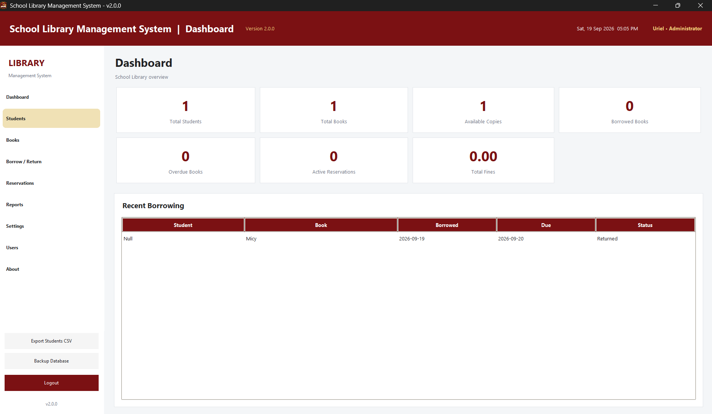

# School Library Management System

**Version 2.00** — a professional Windows desktop library management system designed for schools.

## Publisher

CatholicDiscovery Digital.

## Features

- Student and book management
- Borrowing, returns, due dates and fines
- Reservations and reports
- QR codes, PDF attachments and CSV import/export
- Secure role-based user accounts and password hashing
- Local SQLite storage, backup/restore and optional update checking

## Screenshots

Place verified PNG screenshots in [`screenshots/`](screenshots/). The website is already configured for:

```text
login.png          dashboard.png       students.png
books.png          borrowing.png       reservations.png
reports.png        settings.png        backup.png
```

For example, once supplied, `screenshots/dashboard.png` is shown automatically:



## Installation

Download `SchoolLibrarySystem_Setup_v2.00.exe` from the official GitHub Release once the repository and release URL are configured. Run the installer, follow the wizard, then create the first Administrator account on first launch.

## Data Storage

User data is stored outside Program Files:

```text
%LOCALAPPDATA%\SchoolLibrarySystem
```

## Database

The SQLite database is:

```text
%LOCALAPPDATA%\SchoolLibrarySystem\data\lms.db
```

## Backups

Backups are stored in:

```text
%LOCALAPPDATA%\SchoolLibrarySystem\data\backups
```

## Version

Current release: **2.00**.

## Windows Support

Windows 10 and Windows 11, 64-bit.

## License

See the project’s existing [LICENSE](../LICENSE) file.

## Project Structure

```text
website/
├── index.html          GitHub Pages entry point
├── style.css           Responsive presentation styles
├── script.js           Navigation, link placeholders and screenshot fallback
├── releases/latest.json Release metadata
├── screenshots/        Add verified application PNG screenshots here
└── assets/             logo.png and favicon.ico
```

## Support

CatholicDiscovery Digital is the publisher. Official repository, download, and support URLs have not yet been configured; add them to `script.js` before publishing.
